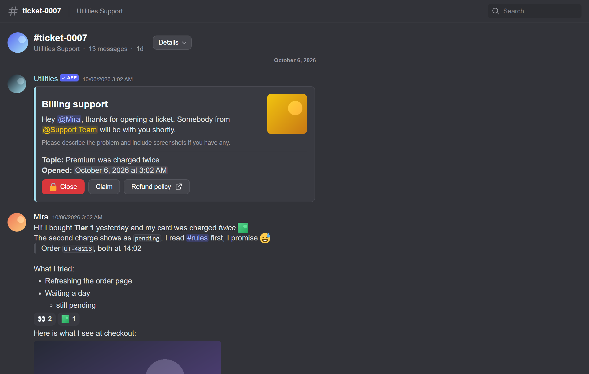
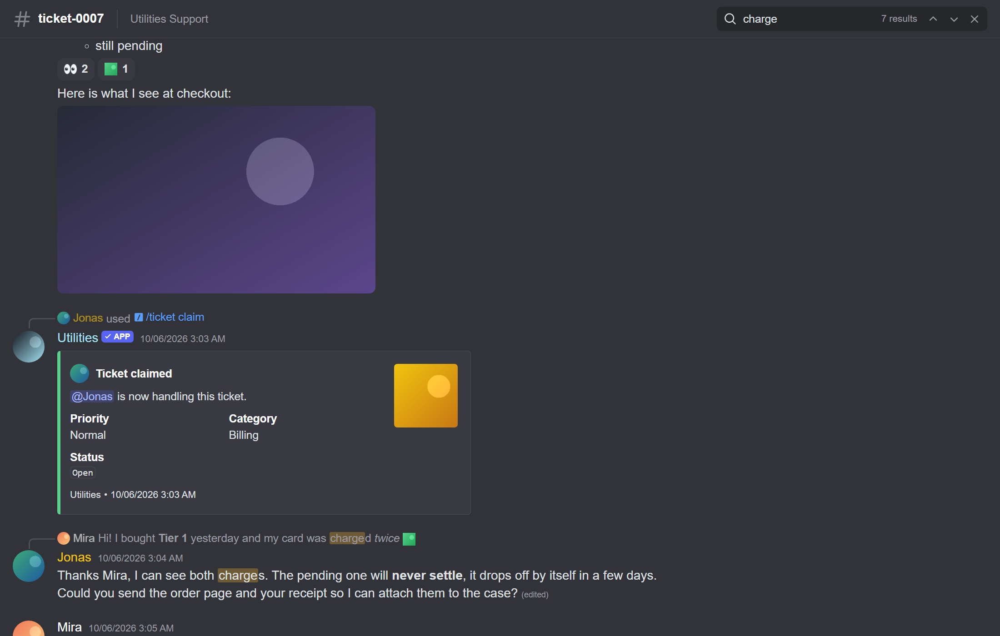
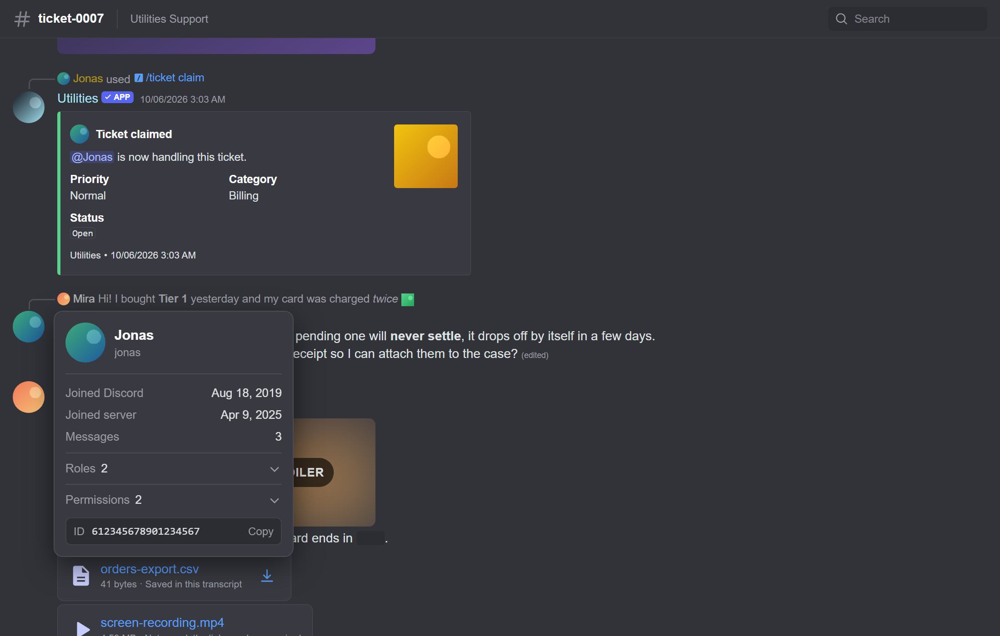
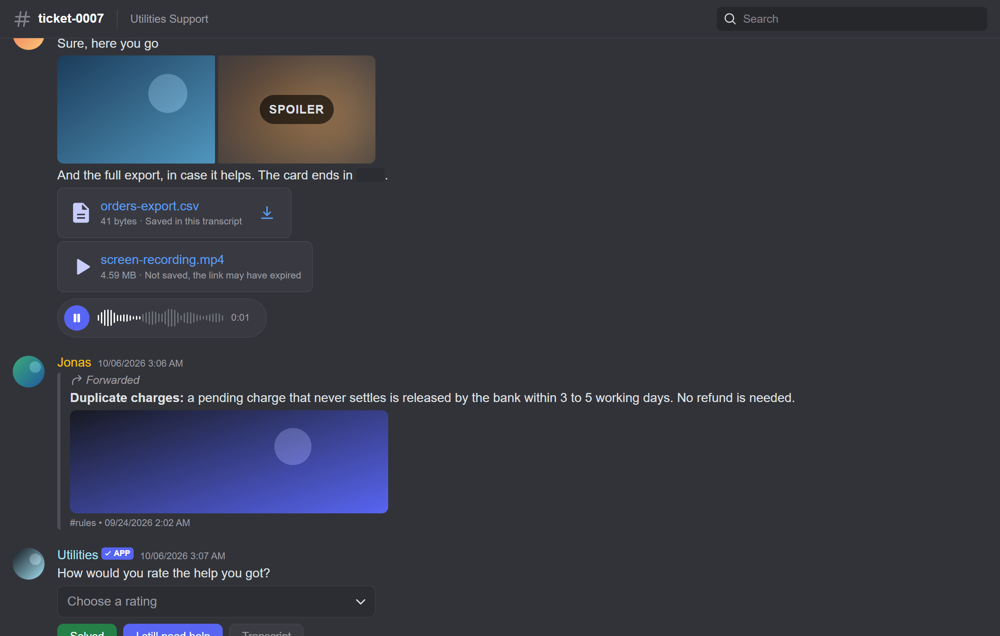
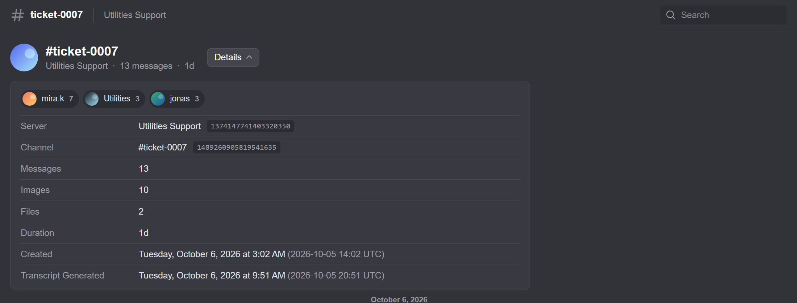

# Transcripts

Turn a Discord channel into **one HTML file** that looks like Discord and opens
anywhere. The messages, the pictures, the files and the viewer are all inside
it, so there is nothing to host and nothing to store.

Built for the [Utilities](https://utilities.best) ticket bot. Free to use in
yours.



## Why this one

- **No storage, no server.** The transcript is the file. Post it in a channel
  and you are done. It opens from a Discord download, offline, or years later.
- **Pictures and files are saved inside it.** Images, avatars, emoji, stickers
  and uploads are written into the file, so they outlive Discord's expiring
  links.
- **Looks like Discord.** Replies, forwards, slash commands, embeds, buttons,
  select menus, containers, reactions, polls, system lines and markdown.
- **Voice messages play.** With their waveform, straight from the file. Saved
  audio and video play too.
- **Signed.** A changed file says so instead of passing as the original.
- **No dependencies.** It does not even import discord.js; it reads messages
  by shape, so it works with any version.

| Search | Profiles |
| --- | --- |
|  |  |

| Voice messages and files | Details |
| --- | --- |
|  |  |

Also in the viewer: right-click to copy text, IDs and message links, click a
picture to enlarge it, click a reply to jump to it, and a layout that works on
a phone.

## Install

```bash
npm install github:utilities-bot/transcripts
```

Node 20 or newer.

## Use it in your bot

```js
import { createTranscript } from "utilities-transcripts";

const transcript = await createTranscript(channel);

await logChannel.send({
  files: [{ attachment: Buffer.from(transcript.html, "utf8"), name: `transcript-${channel.name}.html` }],
});
```

That is the whole setup. `channel` is any discord.js text channel or thread.

### Options

All optional.

```js
const transcript = await createTranscript(channel, {
  limit: 1000,                // newest messages to include; null for the whole channel
  maxFileBytes: 10_000_000,   // keep the whole file under this size
  signingKey: process.env.TRANSCRIPT_SIGNING_KEY,
  brand: { name: "My Bot", url: "https://example.com" },   // credited in the footer
});
```

| Option | What it does |
| --- | --- |
| `limit` | How many of the newest messages to include. Default `1000`. |
| `maxFileBytes` | The largest the file may be. Messages come first, then pictures, then other files; whatever does not fit is left out and counted. A bot can upload 10 MB to an ordinary server. |
| `signingKey` | Signs the file. See [Signing](#signing). |
| `brand` | Your bot's name and link, shown in the footer. |
| `images` | `false` saves no pictures or files at all. |

### What you get back

```js
transcript.html          // the file
transcript.bytes         // its size
transcript.messageCount  // messages in it
transcript.truncated     // older messages left out to fit maxFileBytes
transcript.participants  // [{ userId, username, messageCount }], busiest first
transcript.images        // { saved, skipped, bytes }
transcript.files         // { saved, skipped, bytes }
```

## Signing

Optional. Without a key a transcript works exactly the same; it just cannot
prove it was not edited.

```bash
node -e "import('utilities-transcripts').then((m) => console.log(m.generateKeys()))"
```

This prints two keys:

- the **private key** goes in your bot's environment
  (`TRANSCRIPT_SIGNING_KEY`). Keep it secret and never commit it.
- the **public key** is not a secret. Use it wherever you check a transcript.

```js
import { verifyTranscript } from "utilities-transcripts";

verifyTranscript(html, { trustedKeys: [PUBLIC_KEY] });
// "verified"  signed by your key and unchanged
// "intact"    unchanged, but signed by a key you did not list
// "modified"  edited after it was signed
// "unsigned"  no signature
```

Only `"verified"` means "my bot made this, and nobody changed it".

## Showing transcripts on your website

You do not need this: the file opens by itself. But if you want links like
`yoursite.com/transcript/...`, you still do not need to store anything.

Discord already hosts the file. Have your site fetch the attachment from
Discord when the link is opened, and draw it with the same viewer the file
uses:

```html
<link rel="stylesheet" href="/viewer.css">
<div id="transcript"></div>
<script src="/viewer.js"></script>
<script>
  // `envelope` is the JSON inside the file's <script id="transcript-data"> block.
  // On a server, readTranscript(html).envelope returns it.
  UtilTranscript.mount(document.getElementById("transcript"), envelope, { trustedKeys: [PUBLIC_KEY] });
</script>
```

`viewer.js` and `viewer.css` are in `src/viewer/`, plain files with no build
step (`utilities-transcripts/viewer.js` and `/viewer.css` when installed).

Things to know:

- Discord's attachment links expire after about a day. Re-fetching the message
  gives a fresh one, so make the link from the message, not from a saved URL.
- Draw only transcripts that are `"verified"` with your public key. Otherwise
  anybody could have a file of their own shown on your site.
- Everything from a message is escaped before it reaches the page, and every
  address is checked before it becomes a link or a picture.
- If your site sends a Content-Security-Policy, voice messages and video need
  `media-src blob:`.

## Development

```bash
npm test          # node's own test runner, no network
npm run sample    # writes sample/transcript-sample.html; open it in a browser
```

## Licence

MIT.
